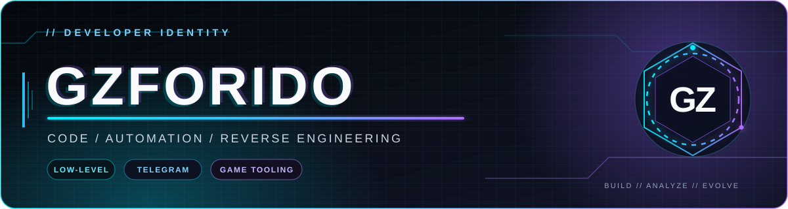

  

  
  

<h3 align="center">Developer exploring systems, automation, and creative tooling</h3>

  <code>C++</code>&nbsp;•&nbsp;<code>C#</code>&nbsp;•&nbsp;<code>Python</code>&nbsp;•&nbsp;<code>JavaScript</code>&nbsp;•&nbsp;<code>Telegram</code>&nbsp;•&nbsp;<code>Reverse Engineering</code>

---

### About me

- Building and studying software across desktop tools, automation, and Telegram projects.
- Interested in decoding, reverse engineering, and game tooling research.
- Growing a practical stack around **C++**, **C#**, **Python**, and **JavaScript**.

### Tech stack

  

  
  
  

### Featured projects

| Project | What it is | Stack |
| :--- | :--- | :---: |
| [**tg-app**](https://github.com/Gzforido/tg-app) | Local AI coding-agent system with a GUI/server architecture, ZeroMQ messaging, and PEFT training workflows. | Python |
| [**cam**](https://github.com/Gzforido/cam) | Dark-themed desktop viewer for RTSP and HTTP IP-camera streams. | Python |

### GitHub activity

  <picture>
    <source media="(prefers-color-scheme: dark)" srcset="https://github-readme-stats-fast.vercel.app/api?username=Gzforido&show_icons=true&hide_border=true&include_all_commits=true&theme=transparent&title_color=00E5FF&text_color=C9D1D9&icon_color=A78BFA" />
    <source media="(prefers-color-scheme: light)" srcset="https://github-readme-stats-fast.vercel.app/api?username=Gzforido&show_icons=true&hide_border=true&include_all_commits=true&theme=transparent&title_color=0969DA&text_color=24292F&icon_color=8250DF" />
    
  </picture>

### Contribution trail

  <picture>
    <source media="(prefers-color-scheme: dark)" srcset="https://raw.githubusercontent.com/Gzforido/Gzforido/output/github-contribution-grid-snake-dark.svg" />
    <source media="(prefers-color-scheme: light)" srcset="https://raw.githubusercontent.com/Gzforido/Gzforido/output/github-contribution-grid-snake.svg" />
    
  </picture>

  Build. Analyze. Improve. Repeat.

